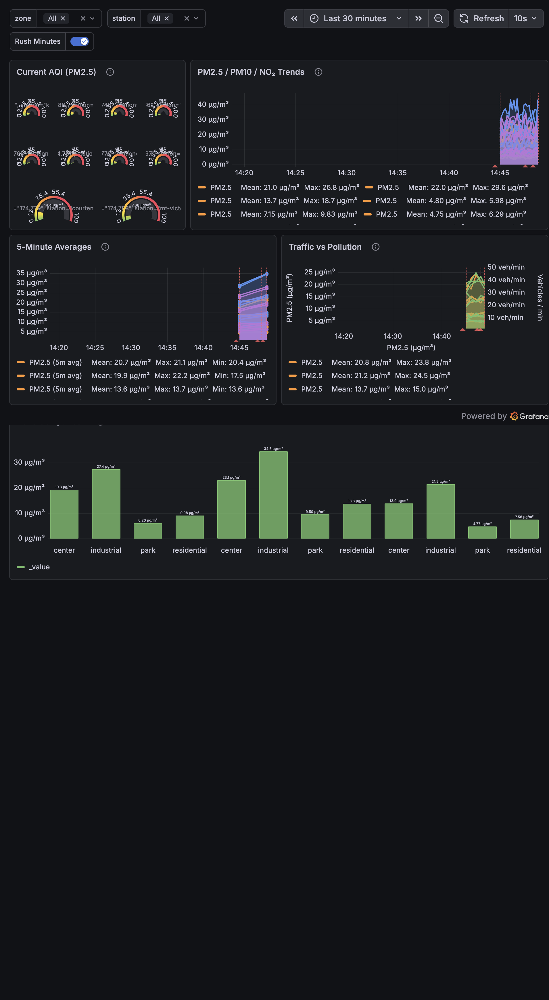
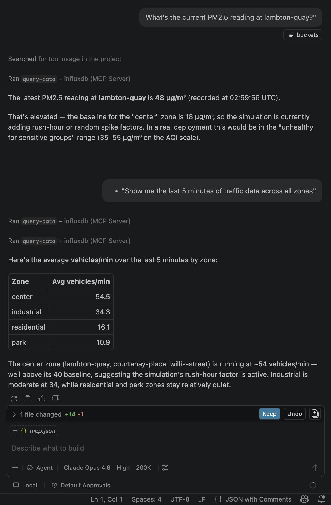

# SmartCity Pulse

**Real-time Urban Air Quality & Traffic Monitoring Pipeline**  
Built with **InfluxDB 2**, **Grafana**, and **Python** — a full time-series data pipeline demo in one afternoon.

  
*(Screenshot of the final Grafana dashboard)*

  
*(Querying InfluxDB directly from Copilot via MCP)*

---

## What This Is

A realistic smart city monitoring pipeline that simulates sensor networks across urban zones, ingests time-series data into InfluxDB 2, and visualizes it with production-grade Grafana dashboards. Built to demonstrate AI-assisted development with GitHub Copilot.

## Features

- **Simulated sensor network** — 10 stations across 4 city zones with realistic rush-hour and diurnal patterns
- **Rich measurements** — PM2.5, PM10, NO₂, traffic flow, temperature, humidity
- **Advanced Flux queries** — windowed aggregations, custom AQI calculations, moving averages, anomaly detection
- **Production-style Grafana dashboards** — gauges, geo maps, heatmaps, time-series overlays, alerting
- **Fully reproducible** — `docker compose up` and everything works (provisioned datasources + dashboards)
- **Clean Python** — type-hinted, well-structured, Copilot-friendly ingestion scripts

## Tech Stack

| Layer | Technology |
|-------|-----------|
| Database | InfluxDB 2 (time-series optimized) |
| Visualization | Grafana 10+ (provisioned dashboards) |
| Ingestion | Python 3.11+ / `influxdb-client` |
| Orchestration | Docker Compose |

## Quick Start

### 1. Clone & Start

```bash
git clone https://github.com/<your-username>/smartcity-pulse.git
cd smartcity-pulse
cp .env.example .env
docker compose up -d
```

### 2. Start Ingestion

```bash
python -m venv .venv && source .venv/bin/activate
pip install -r requirements.txt
python ingest_smartcity.py
```

### 3. Open Dashboards

- **Grafana**: http://localhost:3000 (admin / admin)
- **InfluxDB**: http://localhost:8086

Dashboards are auto-provisioned — no manual setup needed.

### Tear Down

```bash
docker compose down -v
```

## Project Structure

```
smartcity-pulse/
├── docker-compose.yml
├── .env.example
├── requirements.txt
├── ingest_smartcity.py          # Sensor simulation + ingestion
├── config.py                    # Shared config (reads .env)
├── provisioning/
│   ├── datasources/
│   │   └── influxdb.yml         # Auto-configures Grafana datasource
│   └── dashboards/
│       ├── dashboard.yml        # Dashboard provisioning config
│       └── smartcity-pulse.json # Exported dashboard
└── docs/
    └── dashboard-preview.png
```

## Data Model

| Measurement | Tags | Fields |
|-------------|------|--------|
| `air_quality` | `station`, `zone` | `pm25`, `pm10`, `no2`, `aqi` |
| `traffic` | `station`, `zone` | `flow`, `speed`, `congestion_level` |
| `weather` | `station`, `zone` | `temperature`, `humidity` |

**Bucket**: `sensors` · **Retention**: 7 days · **Org**: `smartcity`

## License

MIT